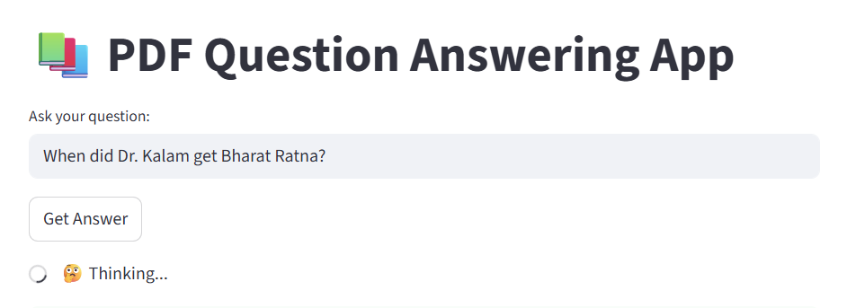
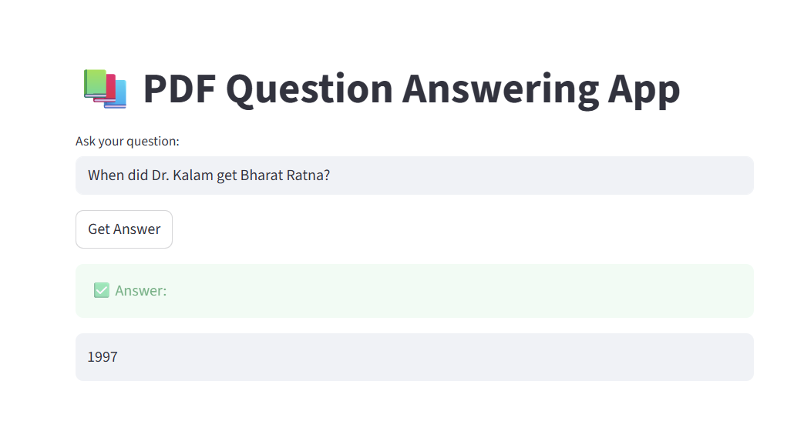
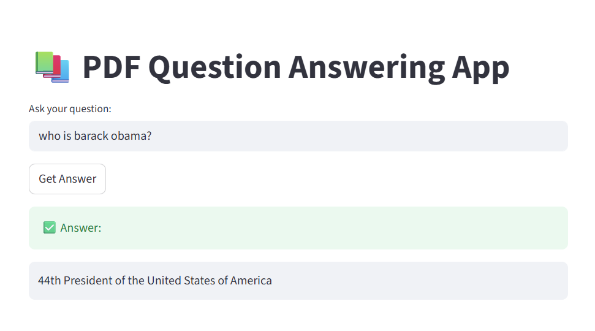

# pdf-chatbot-ai (PDF Question Answering App)
An AI chatbot that reads PDFs and answers questions using a BERT model.

A **Streamlit-based AI Q&A app** that reads multiple PDF documents, extracts their text, and allows users to **ask natural language questions**.  
The app uses a **pretrained BERT model** (`bert-large-uncased-whole-word-masking-finetuned-squad`) from Hugging Face’s `transformers` library to find accurate answers from your PDFs.

---

## 🚀 Features

- 📘 Load all PDFs from a folder (`docs/`)
- 🧠 Uses Hugging Face Transformers pipeline for Question Answering
- ⚡ Caches extracted text and model for faster reloads
- 🤖 Smart handling of compound questions (e.g., “When and where was he born?”)
- 🎨 Simple and clean Streamlit UI

---

## 🗂️ Project Structure

```
📦 PDF-QA-App
│
├── app.py                # Main Streamlit app
├── requirements.txt      # Dependencies
├── docs/                 # Folder containing PDF files
└── README.md             # Project documentation
```

---

## 🧩 Requirements

Make sure you have **Python 3.9+** installed.

---

## ⚙️ Setup Instructions

### 1. Clone or copy the project
```bash
git clone https://github.com/avnikumar/pdf-chatbot-ai.git
cd pdf-chatbot-ai
```

### 2. Create and activate virtual environment
```bash
python -m venv .venv
.venv\Scripts\activate   # On Windows
# or
source .venv/bin/activate  # On Mac/Linux
```

### 3. Install dependencies
```bash
pip install -r requirements.txt
```

Ensure your `requirements.txt` includes:
```
streamlit
transformers
torch
PyPDF2
```

### 4. Add your PDFs
Place all PDF files inside the `docs/` folder.

Example:
```
docs/
├── biography_dr.kalam_sir.pdf
├── barack_obama.pdf
```

### 5. Run the app
```bash
streamlit run app.py
```

Then open the provided local URL (e.g., http://localhost:8501) in your browser.

---

## 💬 How It Works

1. Extracts text from all PDFs (cached for reuse)
2. Loads a Hugging Face question-answering pipeline
3. Splits text into manageable chunks for efficient searching
4. Uses BERT to find the most relevant answer
5. Supports compound questions like “When and where was Dr. Kalam born?”

---

## 🧠 Model Used
**BERT Large Uncased Whole Word Masking (SQuAD fine-tuned)**  
> Model: `bert-large-uncased-whole-word-masking-finetuned-squad`

---

## 🛠️ Troubleshooting

- ❌ `ImportError: cannot import name 'pipeline'`
  → Run: `pip install -U transformers`

- ❌ `ModuleNotFoundError: No module named 'torch'`
  → Run: `pip install torch`

- 🕒 Long first run?
  → The model downloads (~1.3 GB) only once; subsequent runs are cached.

---

## 📄 License

This project is open source under the **MIT License**.

---

## ✨ Example Use Case

> Upload biographies of leaders, company manuals, or research papers,  
> then ask:  
> “What was his major contribution?” or “When and where was he born?”  
> and get instant answers — powered by BERT.


## 🧠 PDF Chatbot Demo

Here’s how it looks in action 👇





Type your question about the PDFs — the model finds the most relevant answer instantly!


💬 Example Questions

Here are some sample questions you can ask after uploading PDFs about Dr. A.P.J. Abdul Kalam:

1. What is the full name of Dr. Kalam?

2. When and where was Dr. Kalam born?

3. When did Dr. kalam become President of India?

4. where did he win the Hoover Medal?

5. who won Hoover Medal?

5. When did he receive the Bharat Ratna award?

6. What are the names of the missiles developed under Dr. APJ Abdul Kalam's leadership.